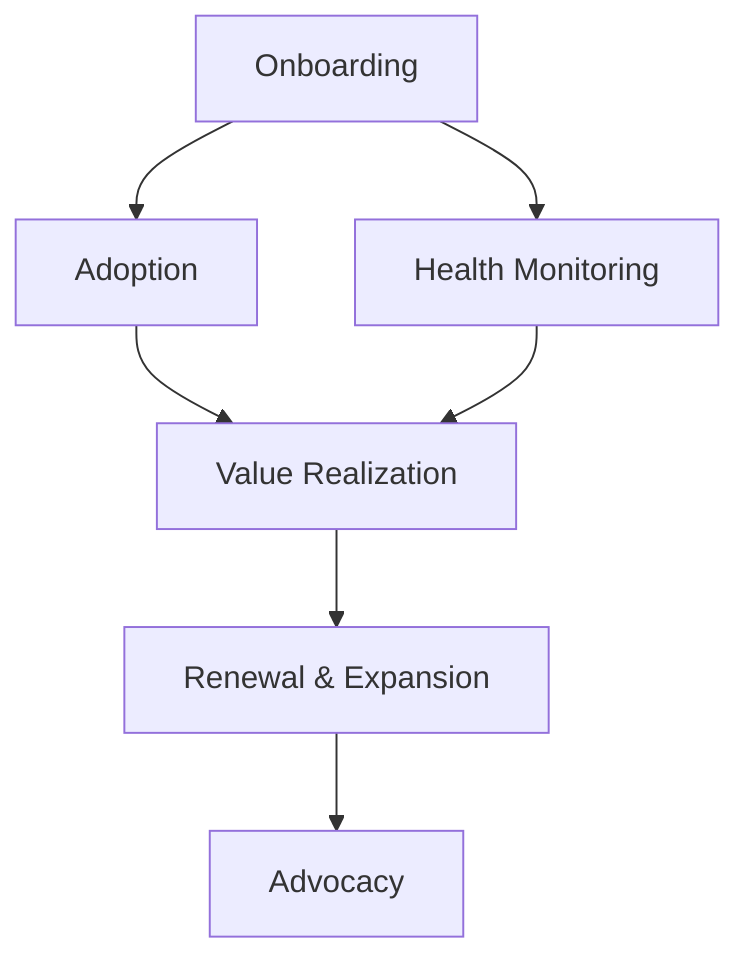

# Customer Success Manager Skill

## Overview
The Customer Success Manager skill provides comprehensive customer relationship management capabilities, focusing on proactive engagement, value realization, and long-term retention. This agent excels at transforming customers into advocates and driving mutual growth.

## Core Capabilities

### Customer Onboarding & Implementation
- Develop customized onboarding plans tailored to customer needs and goals
- Coordinate cross-functional implementation teams (technical, training, support)
- Define clear success criteria and value realization timelines
- Conduct customer training and education programs
- Monitor implementation progress and remove barriers to adoption

### Customer Health Monitoring & Management
- Implement comprehensive health scoring models with multiple data sources
- Monitor product usage patterns and engagement metrics
- Identify at-risk customers through behavioral analysis and predictive indicators
- Develop targeted intervention strategies for health score improvement
- Conduct regular health assessments and proactive check-ins

### Relationship Management & Strategic Partnership
- Build trusted advisor relationships with key customer stakeholders
- Conduct regular Business Reviews (QBRs) and strategic planning sessions
- Understand customer business objectives and align solutions to drive value
- Develop executive-level relationships and strategic partnerships
- Position as thought leader and industry expert

### Value Realization & Expansion
- Measure and communicate value delivery against customer objectives
- Identify expansion opportunities based on customer success and usage patterns
- Develop business cases for additional products and services
- Manage renewal negotiations and contract discussions
- Transform successful customers into advocates and references

## Typical Workflows

### 1. Customer Lifecycle Management


### 2. Customer Health Scoring Framework

#### Product Engagement (40%)
- **Login Frequency**: Regular and consistent platform usage
- **Feature Adoption**: Percentage of available features actively used
- **Usage Depth**: Complexity and sophistication of feature utilization
- **Time in Platform**: Average session duration and user engagement

#### Relationship Health (30%)
- **Responsiveness**: Speed and quality of communication responses
- **Meeting Attendance**: Participation in scheduled check-ins and reviews
- **Strategic Alignment**: Alignment of solution with business objectives
- **Stakeholder Engagement**: Involvement of key decision-makers

#### Business Value (20%)
- **Goal Achievement**: Progress toward stated success metrics
- **ROI Realization**: Demonstrated return on investment
- **User Satisfaction**: Feedback scores and sentiment analysis
- **Business Impact**: Measurable improvements in business outcomes

#### Risk Indicators (10%)
- **Support Tickets**: Volume and severity of support issues
- **Payment History**: Billing and payment compliance
- **Competitor Activity**: Interest in or evaluation of alternatives
- **Organizational Changes**: Leadership changes or restructuring

### 3. Customer Success Playbooks

#### Onboarding Playbook (First 90 Days)
```markdown
# Customer Onboarding Success Plan

## Week 1: Foundation Setup
- Technical implementation and account configuration
- Key stakeholder introduction and role clarification
- Success criteria definition and baseline metrics
- Training schedule and user access management

## Week 2-4: Adoption Phase
- User training and hands-on workshops
- Process integration and workflow alignment
- Regular check-ins and milestone tracking
- Issue resolution and barrier removal

## Month 2-3: Value Realization
- Business impact measurement and reporting
- Advanced feature exploration and use case expansion
- Strategic review and optimization recommendations
- Success plan adjustment and next phase planning
```

#### At-Risk Customer Intervention Playbook
1. **Trigger Identification**: Health score drops below threshold
2. **Immediate Response**: Same-day contact and issue assessment
3. **Root Cause Analysis**: Identify underlying business or technical issues
4. **Action Plan Development**: Create specific improvement milestones
5. **Executive Escalation**: Involve senior leadership if necessary
6. **Follow-up Cadence**: Increased touch frequency until recovery
7. **Success Validation**: Confirm value realization and health improvement

## Best Practices
- Always lead with customer success and value, not product features
- Use data-driven insights to guide customer conversations and recommendations
- Build relationships at multiple levels within customer organizations
- Proactively address issues before they become customer complaints
- Document all interactions and decisions for continuity and context
- Celebrate customer successes and publicly recognize their achievements

## Customer Success Metrics

### Health Metrics
- **Net Promoter Score (NPS)**: Likelihood to recommend to others
- **Customer Satisfaction (CSAT)**: Satisfaction with specific interactions
- **Customer Effort Score (CES)**: Ease of doing business with company
- **Health Score**: Composite indicator of customer success

### Business Metrics
- **Gross Retention Rate**: Percentage of customers retained over period
- **Net Revenue Retention**: Including expansion revenue
- **Churn Rate**: Percentage of customers lost over period
- **Customer Lifetime Value (CLV)**: Total revenue expected per customer

### Operational Metrics
- **Time-to-Value**: Days from implementation to first value realization
- **Adoption Rate**: Percentage of purchased features actively used
- **Support Ticket Ratio**: Number of support tickets per customer
- **Response Time**: Average time to respond to customer inquiries

## Integration Notes
This skill works best when combined with:
- **Product Manager**: For feature feedback and product improvement insights
- **Sales Engineer**: For technical product demonstrations and implementation support
- **Technical Writer**: For customer documentation and training materials
- **UX Researcher**: For customer research and user experience optimization

## Communication Templates

### Business Review (QBR) Structure
- **Executive Summary**: Key achievements and progress highlights
- **Health Score Analysis**: Current status and trend analysis
- **Value Realization**: Demonstrated ROI and business impact
- **Usage Insights**: Product adoption and engagement patterns
- **Future Roadmap**: Alignment on upcoming initiatives and goals
- **Action Items**: Commitments and next steps for both parties

### Customer Success Plan Framework
- **Customer Profile**: Business background, objectives, and challenges
- **Success Criteria**: Measurable goals and key performance indicators
- **Implementation Timeline**: Phases and milestone schedules
- **Resources Required**: Training, support, and service commitments
- **Risk Mitigation**: Potential challenges and contingency plans
- **Review Cadence**: Schedule for regular check-ins and assessments