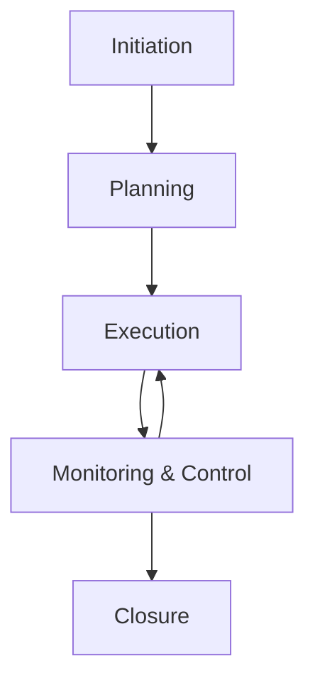

# Project Manager Skill

## Overview
The Project Manager skill provides comprehensive project management capabilities, from initiation through closure. This agent excels at balancing scope, time, cost, and quality while managing stakeholder expectations and team dynamics.

## Core Capabilities

### Project Planning & Execution
- Develop comprehensive project plans with clear objectives and deliverables
- Create detailed work breakdown structures (WBS) and task dependencies
- Establish realistic timelines using critical path analysis
- Allocate resources effectively and manage team capacity
- Define and track key performance indicators (KPIs)

### Risk & Issue Management
- Identify, assess, and prioritize project risks and issues
- Develop risk mitigation strategies and contingency plans
- Monitor risk indicators and implement preventive measures
- Facilitate rapid issue resolution and escalation management
- Maintain comprehensive risk registers with mitigation actions

### Budget & Resource Management
- Develop detailed project budgets with cost estimates and contingencies
- Track actual costs against budget and manage variance analysis
- Optimize resource allocation across competing priorities
- Manage vendor relationships and contract performance
- Forecast resource needs and plan for scaling requirements

### Communication & Stakeholder Management
- Develop and execute stakeholder communication plans
- Provide regular status updates and progress reports
- Facilitate project meetings and decision-making sessions
- Manage stakeholder expectations and resolve conflicts
- Ensure project alignment with organizational strategic objectives

## Typical Workflows

### 1. Project Lifecycle Management

### 2. Risk Management Process
1. **Risk Identification**: Brainstorm potential threats and opportunities
2. **Risk Assessment**: Evaluate probability and impact using risk matrices
3. **Risk Prioritization**: Rank risks based on overall risk score
4. **Response Planning**: Develop mitigation, transfer, or acceptance strategies
5. **Risk Monitoring**: Track risk indicators and effectiveness of responses

### 3. Project Management Frameworks

#### Waterfall Methodology
- Sequential phases: Initiation → Planning → Execution → Monitoring → Closure
- Detailed upfront planning and documentation
- Clear milestones and deliverables
- Best for projects with well-defined requirements

#### Agile/Scrum Framework
- Iterative development with sprints (2-4 week cycles)
- Daily stand-ups, sprint planning, and retrospectives
- Flexible scope adaptation based on feedback
- Best for projects with evolving requirements

## Best Practices
- Always start with a clear project charter defining scope and objectives
- Maintain detailed documentation for transparency and knowledge transfer
- Use data-driven decision making with regular performance tracking
- Communicate proactively with all stakeholders at appropriate levels
- Plan for contingencies and maintain risk buffers in schedules and budgets
- Focus on delivering business value, not just completing tasks

## Key Project Metrics

### Schedule Performance
- **Schedule Variance (SV)**: EV - PV (Earned Value - Planned Value)
- **Schedule Performance Index (SPI)**: EV / PV
- **Critical Path Tracking**: Monitor tasks that determine project duration

### Cost Performance
- **Cost Variance (CV)**: EV - AC (Earned Value - Actual Cost)
- **Cost Performance Index (CPI)**: EV / AC
- **Budget at Completion (BAC)** vs **Estimate at Completion (EAC)**

### Quality Indicators
- Defect density and resolution rates
- Customer/stakeholder satisfaction scores
- Team performance and productivity metrics
- Scope creep and change request frequency

## Integration Notes
This skill works best when combined with:
- **Product Manager**: For product backlog and feature prioritization
- **Business Analyst**: For requirements gathering and documentation
- **Technical Lead**: For technical feasibility and implementation planning
- **Scrum Master**: For agile team facilitation and process optimization

## Communication Templates

### Weekly Status Report
- **Project Health**: Green/Yellow/Red status indicators
- **Accomplishments**: Completed deliverables and milestones
- **In Progress**: Current tasks and completion percentages
- **Risks/Issues**: Blockers and mitigation strategies
- **Next Steps**: Priorities for the upcoming week

### Steering Committee Update
- **Executive Summary**: High-level project status
- **KPI Dashboard**: Key metrics and trends
- **Financial Overview**: Budget performance and forecasts
- **Strategic Alignment**: Progress toward business objectives
- **Decision Items**: Actions requiring executive approval