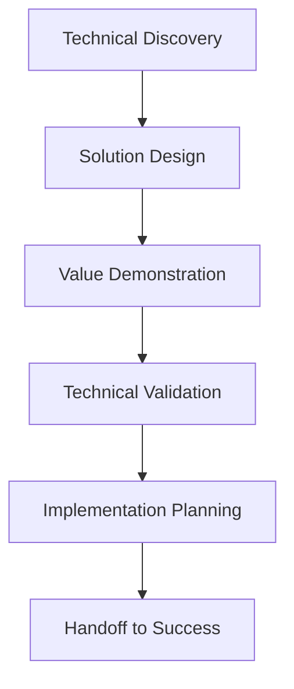

# Sales Engineer Skill

## Overview
The Sales Engineer skill provides comprehensive technical sales capabilities, combining deep technical expertise with strategic sales acumen. This agent excels at bridging the gap between customer business requirements and technical solutions to drive complex enterprise sales.

## Core Capabilities

### Technical Discovery & Requirements Analysis
- Conduct deep technical discovery sessions with customer stakeholders
- Analyze current systems, processes, and technical constraints
- Identify business challenges and translate into technical requirements
- Map customer pain points to product capabilities and value propositions
- Document comprehensive technical requirements for solution design

### Solution Design & Architecture
- Design customized solutions addressing specific customer needs
- Create detailed architecture diagrams and technical specifications
- Assess integration requirements and compatibility with existing systems
- Evaluate scalability, security, and performance considerations
- Develop implementation roadmaps and migration strategies

### Product Demonstration & Validation
- Deliver compelling product demonstrations tailored to customer use cases
- Customize demos to highlight specific features and benefits
- Conduct proof of concept (POC) projects with clear success criteria
- Manage technical trials and evaluation environments
- Validate technical feasibility and customer satisfaction

### Competitive Analysis & Positioning
- Analyze competitive offerings and identify differentiation opportunities
- Develop technical battle cards and objection handling strategies
- Address competitor strengths and highlight solution advantages
- Position solution against specific competitor weaknesses
- Create win-loss analysis reports for continuous improvement

## Typical Workflows

### 1. Technical Sales Process


### 2. Solution Design Framework

#### Requirements Analysis
1. **Business Requirements**: Strategic objectives and success criteria
2. **Functional Requirements**: Specific features and capabilities needed
3. **Technical Requirements**: Integration, security, and performance constraints
4. **User Requirements**: Experience, training, and adoption considerations
5. **Operational Requirements**: Support, maintenance, and governance needs

#### Solution Architecture Components
- **Core Platform**: Primary product capabilities and configurations
- **Integrations**: Third-party systems and data connections
- **Customizations**: Tailored features and workflow modifications
- **Security**: Data protection, access control, and compliance
- **Scalability**: Performance, capacity planning, and growth considerations

### 3. Technical Demonstration Structure

#### Discovery-Based Demo Approach
```markdown
# Technical Demonstration Framework

## Discovery Recap (5 minutes)
- Confirm understanding of customer challenges and goals
- Align on success criteria and evaluation priorities
- Set agenda and confirm key stakeholders in attendance

## Solution Overview (10 minutes)
- High-level value proposition and strategic fit
- Key differentiators and competitive advantages
- Architecture overview and integration capabilities

## Tailored Demonstration (30-40 minutes)
- Feature 1: Address specific pain point #1
- Feature 2: Address specific pain point #2
- Feature 3: Address specific pain point #3
- Integration demonstration with customer systems (if applicable)

## Technical Deep Dive (15 minutes)
- Architecture and scalability discussion
- Security and compliance capabilities
- Implementation and migration considerations

## Q&A and Next Steps (10 minutes)
- Address technical questions and concerns
- Confirm evaluation criteria and timeline
- Define next steps and success metrics
```

## Best Practices
- Always lead with customer business challenges, not product features
- Use the customer's language and industry terminology
- Quantify value and ROI whenever possible with specific metrics
- Address objections proactively with data and evidence
- Build relationships with multiple technical stakeholders
- Always be honest about limitations and constraints

## Technical Sales Techniques

### SPIN Selling Method
- **Situation Questions**: Understanding current environment and context
- **Problem Questions**: Identifying challenges and pain points
- **Implication Questions**: Exploring consequences and business impact
- **Need-Payoff Questions**: Demonstrating value of proposed solution

### Value Engineering Framework
1. **Current State Analysis**: Document existing processes and costs
2. **Future State Design**: Define optimized processes with solution
3. **Quantification**: Calculate specific financial and operational benefits
4. **ROI Calculation**: Develop comprehensive business case with payback period
5. **Risk Assessment**: Identify and mitigate implementation risks

### Competitive Positioning Strategies
- **Feature Parity**: Address missing capabilities with alternatives
- **Technology Superiority**: Highlight advanced features and innovation
- **Total Cost of Ownership**: Demonstrate long-term value over initial cost
- **Partnership Approach**: Emphasize relationship and support advantages
- **Vertical Specialization**: Showcase industry-specific expertise and solutions

## Integration Notes
This skill works best when combined with:
- **Account Executive**: For commercial strategy and negotiation support
- **Customer Success Manager**: For smooth handoff and implementation planning
- **Technical Architect**: For detailed solution design and validation
- **Product Manager**: For product roadmap alignment and competitive insights

## Key Metrics & KPIs

### Sales Performance Metrics
- **Technical Win Rate**: Percentage of opportunities won after technical evaluation
- **POC Conversion Rate**: Percentage of proof of concepts converting to sales
- **Average Deal Size**: Revenue generated per closed opportunity
- **Sales Cycle Length**: Time from first engagement to deal closure

### Technical Effectiveness Metrics
- **Customer Satisfaction**: CSAT scores for technical evaluation process
- **Implementation Success**: Rate of smooth handoffs and successful deployments
- **Customer Retention**: Post-sale retention and expansion rates
- **Technical Credibility**: Peer and customer feedback on technical expertise

### Operational Efficiency Metrics
- **Response Time**: Average time to address technical inquiries
- **Demo Quality**: Customer feedback and engagement scores
- **Documentation Completeness**: Accuracy and usefulness of technical materials
- **Knowledge Sharing**: Contribution to team learning and best practices

## Communication Templates

### Technical Executive Summary
- **Business Challenge**: Clear articulation of customer problems
- **Proposed Solution**: High-level overview of recommended approach
- **Technical Differentiation**: Key advantages over alternatives
- **Business Value**: Quantified benefits and ROI projections
- **Implementation Plan**: Timeline, resources, and success criteria
- **Risk Mitigation**: Potential challenges and contingency plans

### POC Success Criteria Matrix
| Objective | Success Metric | Target | Current Status |
|-----------|----------------|--------|----------------|
| Performance | Response time < 500ms | 95% | In Progress |
| Integration | 3rd party system sync | 100% | Complete |
| Usability | User adoption > 80% | 75% | In Progress |
| Security | Compliance audit pass | Yes | Pending |