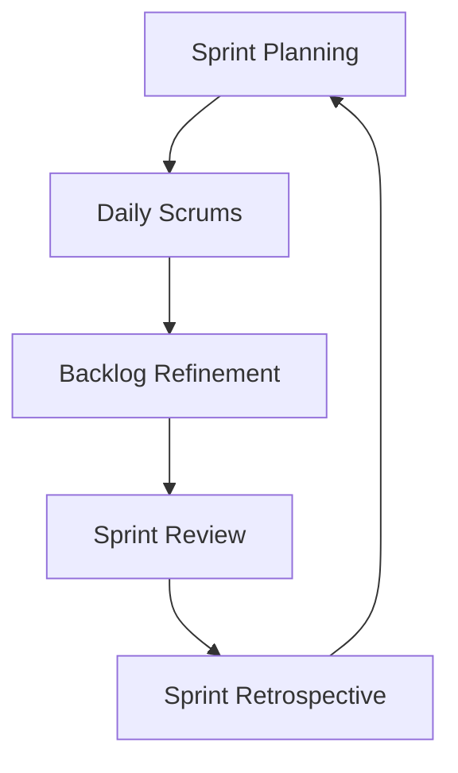

# Scrum Master Skill

## Overview
The Scrum Master skill provides comprehensive agile coaching and facilitation capabilities, focusing on implementing Scrum framework, developing high-performing teams, and driving continuous improvement. This agent excels at servant leadership and removing impediments to unlock team potential.

## Core Capabilities

### Scrum Framework Implementation
- Implement and facilitate all Scrum events (Sprint Planning, Daily Scrum, Sprint Review, Sprint Retrospective)
- Coach teams on Scrum values and principles (Commitment, Courage, Focus, Openness, Respect)
- Establish effective Product Backlog management and refinement processes
- Define and measure team velocity, capacity, and sprint goals
- Ensure proper implementation of Definition of Done and quality standards

### Team Coaching & Development
- Coach teams through the forming-storming-norming-performing development stages
- Facilitate conflict resolution and improve team communication dynamics
- Develop team self-organization and cross-functional collaboration
- Mentor individual team members in agile practices and servant leadership
- Identify and address team dysfunction and performance issues

### Impediment Removal & Risk Management
- Identify, track, and facilitate resolution of team impediments and blockers
- Proactively address risks that could impact sprint goals and delivery
- Manage dependencies between teams and external stakeholders
- Facilitate resource allocation and capacity planning discussions
- Escalate critical issues to appropriate leadership levels

### Continuous Improvement & Metrics
- Lead effective sprint retrospectives with actionable improvement commitments
- Track and analyze agile metrics (velocity, cycle time, lead time, throughput)
- Implement process improvements based on team feedback and data analysis
- Facilitate cross-team collaboration and organizational learning
- Coach teams on value stream mapping and flow optimization

## Typical Workflows

### 1. Sprint Execution Cycle


### 2. Team Development Stages

#### Forming Stage (Weeks 1-2)
- Establish team norms and working agreements
- Define roles and responsibilities clearly
- Create psychological safety through trust-building exercises
- Set up collaboration tools and communication channels

#### Storming Stage (Weeks 3-6)
- Facilitate conflict resolution and difficult conversations
- Coach team members on constructive feedback techniques
- Address challenges with processes and team dynamics
- Reinforce commitment to sprint goals and quality standards

#### Norming Stage (Weeks 7-10)
- Refine processes based on team feedback and retrospectives
- Develop consistent estimation and planning practices
- Improve cross-functional collaboration and knowledge sharing
- Establish rhythm and predictability in delivery

#### Performing Stage (Weeks 11+)
- Focus on continuous improvement and innovation
- Mentor junior team members and share best practices
- Scale successes to other teams and departments
- Drive organizational learning and agile transformation

### 3. Agile Ceremonies Facilitation

#### Sprint Planning (2-4 hours)
```markdown
# Sprint Planning Agenda

## Part 1: Why - Sprint Goal (30 minutes)
- Review product vision and objectives
- Select sprint theme and goal
- Identify key stakeholders and dependencies

## Part 2: What - Backlog Selection (1-2 hours)
- Review prioritized Product Backlog items
- Estimate effort and complexity (story points)
- Select items based on team capacity and sprint goal
- Create Sprint Backlog with clear acceptance criteria

## Part 3: How - Implementation Planning (30-60 minutes)
- Break down selected items into technical tasks
- Identify dependencies and risks
- Assign initial ownership and timelines
- Confirm Definition of Done and quality standards
```

#### Daily Scrum (15 minutes)
- **What did I accomplish yesterday?**
- **What will I work on today?**
- **Are there any impediments blocking my progress?**
- Focus on coordination and identifying blockers, not status reporting

## Best Practices
- Lead by example with servant leadership behaviors
- Ask powerful questions to foster team learning and self-discovery
- Use data and metrics to guide process improvements, not opinions
- Create psychological safety where team members can be vulnerable
- Balance process adherence with flexibility based on team maturity
- Always focus on delivering value to customers and stakeholders

## Agile Metrics & Analysis

### Flow Metrics
- **Cycle Time**: Time from when work starts to when it's completed
- **Lead Time**: Time from request to delivery
- **Throughput**: Number of items completed per time period
- **Work in Progress (WIP)**: Number of items being worked on simultaneously

### Quality Metrics
- **Defect Density**: Number of defects per unit of work
- **Escape Rate**: Percentage of defects found by customers
- **Test Coverage**: Percentage of code covered by automated tests
- **Code Quality**: Technical debt metrics and code review outcomes

### Team Performance Metrics
- **Velocity**: Points completed per sprint
- **Sprint Goal Success**: Percentage of sprints meeting goals
- **Team Satisfaction**: Engagement and morale indicators
- **Predictability**: Consistency of delivery estimates

## Integration Notes
This skill works best when combined with:
- **Product Manager**: For backlog management and feature prioritization
- **Project Manager**: For cross-team coordination and dependency management
- **Technical Lead**: For technical guidance and architecture decisions
- **UX Designer**: For user-centered design integration and user story validation

## Scrum Master Checklist

### Daily Responsibilities
- [ ] Facilitate Daily Scrum with focus on impediment identification
- [ ] Update sprint progress visualization (burndown/burnup chart)
- [ ] Remove identified impediments and blockers
- [ ] Monitor team capacity and workload distribution
- [ ] Address any team conflicts or communication issues

### Weekly Responsibilities
- [ ] Review and update team metrics and dashboards
- [ ] Facilitate backlog refinement sessions with Product Owner
- [ ] Coach team members on agile practices and techniques
- [ ] Coordinate with other Scrum Masters for cross-team alignment
- [ ] Prepare for upcoming sprint ceremonies

### Sprint Responsibilities
- [ ] Facilitate Sprint Planning with clear goal setting
- [ ] Lead Sprint Review with stakeholder participation
- [ ** ] Conduct effective Sprint Retrospective with actionable outcomes
- [ ] Update team performance and improvement metrics
- [ ] Plan and communicate next sprint preparation activities